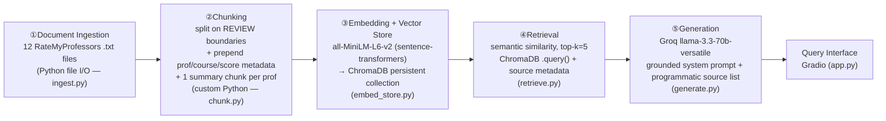

# Project 1 Planning: The Unofficial Guide

> Written before pipeline code. This spec is what I hand to Claude (in Cursor) to generate each
> pipeline stage. The more specific it is, the more useful the generated code.
> Updated during implementation if chunking/retrieval choices change; updated before any stretch feature.

---

## Domain

**Northeastern University CS professor & course reviews** — what students actually say about Khoury
College of Computer Sciences professors and the courses they teach (teaching style, exam/workload
reality, grading, how much they care, whether to take them).

This knowledge is valuable and hard to find through official channels because the registrar's course
catalog and the official "course evaluations" (TRACE) only give you a sanitized title, a one-paragraph
description, and aggregate numbers locked behind a login. They never tell you that one CS3650 section
"rambles for an hour about a concept he never defined," that a Fundies professor gives "the best
introduction to CS I could have asked for," or that two different CS3200 Database professors split
sharply on difficulty. That signal lives in student-generated reviews (RateMyProfessors), and it is
exactly what an incoming student needs to decide which section to register for.

---

## Documents

12 documents, one per professor, collected from **RateMyProfessors** (the canonical public source for
this domain). Each file holds that professor's profile header (overall rating, would-take-again %,
difficulty, courses) plus 4–5 verbatim student reviews with per-review course code, date, quality and
difficulty scores, and tags. Sources span different course areas so the corpus can answer a *range* of
questions (intro, Fundies, systems, theory, algorithms, networks, databases, web) and supports
*comparative* questions (three Fundies professors; two Database professors).

| #  | Source (Professor) | Course area | URL or location |
|----|--------------------|-------------|-----------------|
| 1  | Leena Razzaq       | Intro CS (CS2000/CS2100) | https://www.ratemyprofessors.com/professor/1682644 → `documents/rmp_razzaq.txt` |
| 2  | David Choffnes     | Networks (CS3700/4700/5700) | https://www.ratemyprofessors.com/professor/2219053 → `documents/rmp_choffnes.txt` |
| 3  | Benjamin Lerner    | Fundies / Compilers (CS2500/2510/4410) | https://www.ratemyprofessors.com/professor/2034405 → `documents/rmp_lerner.txt` |
| 4  | Benjamin Hescott   | Theory / Discrete (CS1800/2810/3800) | https://www.ratemyprofessors.com/professor/2365410 → `documents/rmp_hescott.txt` |
| 5  | Nathaniel Tuck     | Systems / Robotics (CS3650/5335) | https://www.ratemyprofessors.com/professor/2044282 → `documents/rmp_tuck.txt` |
| 6  | Nathaniel Derbinsky| Fundies (CS2500) | https://www.ratemyprofessors.com/professor/2308643 → `documents/rmp_derbinsky.txt` |
| 7  | Jose Annunziato    | Web Development (CS4550) | https://www.ratemyprofessors.com/professor/1980304 → `documents/rmp_annunziato.txt` |
| 8  | Amal Ahmed         | Fundies (CS2500) | https://www.ratemyprofessors.com/professor/1626525 → `documents/rmp_ahmed.txt` |
| 9  | Karl Lieberherr    | Intro computing (CS1100/1101) | https://www.ratemyprofessors.com/professor/430930 → `documents/rmp_lieberherr.txt` |
| 10 | Mark Fontenot      | Databases (CS3200) | https://www.ratemyprofessors.com/professor/2868024 → `documents/rmp_fontenot.txt` |
| 11 | Rajmohan Rajaraman | Algorithms (CS3000/5800) | https://www.ratemyprofessors.com/professor/157371 → `documents/rmp_rajaraman.txt` |
| 12 | Wolfgang Gatterbauer | Databases (CS3200) | https://www.ratemyprofessors.com/professor/2303072 → `documents/rmp_gatterbauer.txt` |

**Cleaning note:** RateMyProfessors is JS-rendered and surrounded by nav/ads; I extracted only the
profile stats and review comments (no HTML, nav, share buttons). One review in `rmp_lieberherr.txt`
contained graphic self-harm statements unrelated to the teaching/course signal; I removed that single
review and kept the other four, which already convey the same substantive complaints (AI-based
teaching, 6–13h assignments, low exam averages).

---

## Chunking Strategy

**Chunk size:** One **review per chunk** — I split each document on its `REVIEW |` boundary rather than
by a fixed character count. Reviews here are 1–5 sentences (~40–120 words, ~250–700 characters; mean
≈ 80 words), so a review *is* the natural semantic unit. I additionally emit one short **summary chunk
per professor** (~30 words) carrying the overall rating / would-take-again / difficulty / course list.
Expected total ≈ **12 summary + 59 review = 71 chunks**.

**Overlap:** **0.** Overlap exists to rescue a fact that a fixed-size splitter cut in half. Because I
split on whole-review boundaries, no opinion is ever cut mid-thought, so overlap would only paste an
unrelated student's opinion onto the next chunk and blur the embedding. Overlap would help a long FAQ;
it hurts a review corpus.

**Reasoning + self-containment:** A bare comment like *"very kind and approachable"* has no professor
name or course in it — it would never match a query for "Rajaraman" and its source would be ambiguous.
So each review chunk is **prefixed with context** before embedding:

```
Professor Nathaniel Tuck (Northeastern CS) — Course CS3650 | 2021-03-22 | Quality 1.0/5, Difficulty 5.0/5 | Tags: Lots of homework, Tough grader
Tuck is completely unwilling to explain concepts from scratch, often rambling for an hour and a half...
```

This makes every chunk independently retrievable and self-attributing.

**How I'll know the size is wrong:** If chunks were too *large* (e.g. all 5 reviews of a professor in
one chunk), a query about exam difficulty would match the same blob as a query about whether they're
caring — distances would be flat and similar across unrelated queries. If chunks were too *small* (e.g.
half a sentence), top results would be fragments like "the worst experience I've had" with no idea who
or what course — high distance, no usable signal.

---

## Retrieval Approach

**Embedding model:** `all-MiniLM-L6-v2` via `sentence-transformers` (384-dim, ~256-token max, runs
locally on CPU, no API key, no rate limit). It is a strong default for short English text and our
chunks are far under its token limit, so nothing is truncated.

**Top-k:** **5.** Five chunks is enough to give the LLM a few corroborating reviews for a single
professor without flooding the prompt. Too few (k=1–2) risks missing the relevant review entirely or
showing only one side of a polarized professor; too many (k=15) drags in low-relevance chunks from
unrelated professors that dilute the context and pull the answer off-topic. I'll start at 5 and tune
after seeing real distances in Milestone 4. **Known tension:** comparative questions (e.g. "rank the
three Fundies professors") need chunks from *multiple* professors, and a global top-5 can be dominated
by one professor — I expect this to surface as a failure case and may raise k or retrieve per-source.

**Distance gate (added during implementation, M5 — not in the original spec):** retrieval also
returns the cosine distance of the closest match; if it exceeds **0.72** the pipeline refuses
*before* calling the LLM. Calibrated empirically: in-scope queries scored ≤0.55, while out-of-scope
queries (dining halls, housing) scored ≥0.68. Added as a structural grounding safeguard after
observing that separation.

**Why semantic search works here:** queries rarely share exact words with reviews ("most helpful
feedback" vs a review tagged "Gives good feedback" / "quick to grade and explain"). Embeddings place
both near each other in vector space by *meaning*, so we retrieve the relevant review even with zero
word overlap.

**Production tradeoff reflection (cost no object):** I'd weigh —
- **Accuracy on domain text:** larger models (e.g. `bge-large-en-v1.5`, `e5-large-v2`, OpenAI
  `text-embedding-3-large`) rank higher on MTEB and would separate near-duplicate "caring professor"
  reviews better. Worth it if retrieval precision is the bottleneck.
- **Context length:** MiniLM's 256 tokens is fine for reviews but would truncate long syllabi/guides; a
  long-context embedder (OpenAI 8k, Voyage) matters only if I expand the domain to long documents.
- **Multilingual:** MiniLM is English-centric. If reviews came in multiple languages I'd switch to
  `paraphrase-multilingual-MiniLM` / `multilingual-e5` / Cohere multilingual.
- **Latency & local-vs-API:** local MiniLM has zero network latency and no quota — great for a demo and
  for privacy. An API embedder adds round-trips and vendor lock-in but scales without local GPU. Since
  these reviews are already public, privacy isn't the deciding factor; I'd pick API only if accuracy
  gains clearly beat the added latency/cost.

---

## Evaluation Plan

Five specific, checkable questions (answers verifiable against the cited files). #1 and #4 are
deliberately *comparative* to stress multi-document retrieval and expose a likely failure case.

| # | Question | Expected answer |
|---|----------|-----------------|
| 1 | Among the Fundies (CS2500) professors Lerner, Derbinsky, and Ahmed, who has the highest student rating, and what do students praise? | **Derbinsky** is highest (4.8/5, 97% would-take-again) vs Ahmed 4.0 and Lerner 3.6. Praised for engaging/funny lectures, explaining functional programming to beginners, caring, quick feedback. |
| 2 | What do students say about the workload and teaching style of Nat Tuck's CS3650 Computer Systems course? | Very hard (difficulty 5/5), lots of homework, "skip class, you won't pass." Polarized: some say he distills lectures to the core essentials and challenges are reasonable; others say he won't explain concepts from scratch, rambles, and is unhelpful. |
| 3 | Which Northeastern CS professor is most often described as caring and giving good/affirming feedback? | **Rajmohan Rajaraman** (algorithms) — "kind and caring and SO affirming," "one of the best," 100% would take again. (Derbinsky also fits: "Gives good feedback," "quick to grade and explain feedback.") |
| 4 | Students compare the two CS3200 Database professors, Mark Fontenot and Wolfgang Gatterbauer. How do students describe the difference? | Gatterbauer = easier ("easy A," intuitive, heavy curve, A-cutoff 73) but lower rated (2.6) with strong detractors (unresponsive on Piazza before the final). Fontenot = described as the harder/"learn more" option; engaging lectures + extra credit for some, but others call him unapproachable/rude and say he ghosts questions. |
| 5 | What are the main student complaints about Karl Lieberherr's CS1100/CS1101 intro courses? | Heavy reliance on AI-based teaching ("taught by claude"), very long weekly assignments (6–13+ hours), low exam averages (~40–50%), hard to understand, unhelpful/slow TAs, contradictory stance on student AI use. |

---

## Anticipated Challenges

1. **Comparative queries vs. global top-k.** Q1 and Q4 need chunks from *several* professors, but
   semantic search returns the k globally-nearest chunks, which can all come from the single
   best-matching professor — so the answer omits the others. Tied to the retrieval stage; likely my
   documented failure case.

2. **Polarized professors / one-sided answers.** Most professors have both 1★ and 5★ reviews
   (Tuck, Gatterbauer, Annunziato). Whichever side dominates the retrieved k can make the LLM give a
   one-sided verdict ("he's great" / "avoid him") instead of representing the real split.

3. **Quantitative aggregates live in only one chunk.** "Overall rating" exists only in the per-professor
   summary chunk. If that chunk isn't retrieved, the model may try to average the visible per-review
   scores itself and state a number that isn't grounded — a hallucination risk to watch in grounding.

---

## Architecture



---

## AI Tool Plan

I'm using **Claude (Opus, in the terminal/Cursor)** as the implementer, directed by the sections above.
For each stage I hand Claude specific parts of this spec and verify the output against it.

**Milestone 3 — Ingestion and chunking:** Give Claude the **Documents** + **Chunking Strategy** sections
and the file format sample. Ask it to implement `load_documents()` (read every `documents/*.txt`, parse
the header + `REVIEW |` blocks) and `chunk_document()` (one chunk per review with the prof/course/score
prefix, plus one summary chunk per professor, each carrying metadata `{source_file, professor, course,
chunk_type, position}`). **Verify:** print 5 random chunks — each must be self-contained, name its
professor, and carry no HTML; assert total chunk count ≈ 71 and no zero-length chunks.

**Milestone 4 — Embedding and retrieval:** Give Claude the **Retrieval Approach** section + the
architecture diagram. Ask it to embed all chunks with `all-MiniLM-L6-v2` and upsert into a persistent
ChromaDB collection with the metadata above, then implement `retrieve(query, k=5)` returning chunks +
sources + distances. **Verify:** run 3 eval questions, print chunks + distances, confirm top distance
< 0.5 and chunks are on-topic before touching generation. If a ChromaDB API call is unfamiliar, ask
Claude to explain it.

**Milestone 5 — Generation and interface:** Give Claude the grounding requirement (answer only from
retrieved context; say "I don't have enough information" otherwise) and the output contract
(`{answer, sources}` where sources are added *programmatically* from chunk metadata, not invented by the
LLM). Ask it to write the Groq call + prompt template and a Gradio UI. **Verify:** read the system
prompt to confirm grounding is enforced, then run an out-of-scope query (e.g. dining halls) and confirm
the system refuses instead of using general knowledge.

---

## Stretch Features Credit Log

_(Update this section before starting any stretch feature.)_
- **Chunking Strategy Comparison (+1) — done (2026-06-10):** compares the project's review-level chunking
  against a naive fixed-size (500-char / 50-overlap) splitter on the same 5 evaluation queries, measuring
  how many of each query's top-5 retrieved chunks come from the professor file that should answer it.
  Implemented in `compare_chunking.py`; results + analysis reported in the README.
- **Hybrid Search (+2) — done (2026-06-10):** BM25 (lexical) fused with semantic search via Reciprocal
  Rank Fusion in `hybrid.py`, exposed as a toggle in `generate.ask(use_hybrid=...)` and the Gradio UI.
  Compared against BM25-only and semantic-only on 3 queries in the README; directly fixes the Q1 failure
  (BM25 guarantees the exact surname "Ahmed" surfaces).
- Other candidates not done: metadata filtering, conversational memory.
